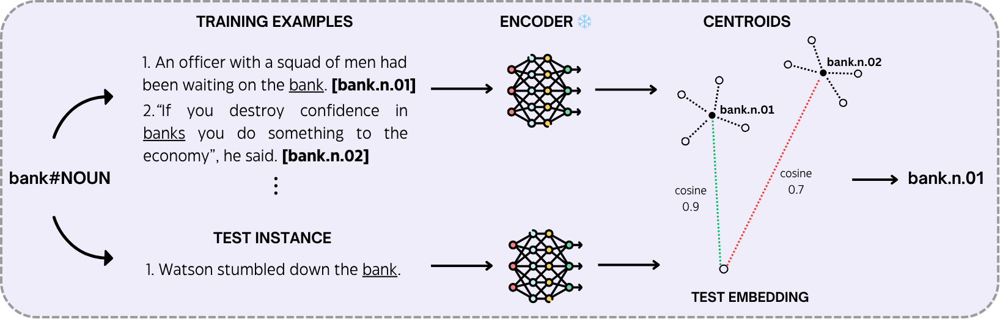

# How Much Do Encoder Models Know About Word Senses? 

<!-- [](https://openreview.net/forum?id=VCORXe6I5B) -->
[](https://creativecommons.org/licenses/by/4.0/)
## 📌 Official Repository

This is the official repository for the paper “How Much Do Encoder Models Know About Word Senses?", accepted at ACL 2025.

## 📝 Abstract

> Word Sense Disambiguation (WSD) is a key task in Natural Language Processing (NLP), involving selecting the correct meaning of a word based on its context. With Pretrained Language Models (PLMs) like BERT and DeBERTa now well established, significant progress has been made in understanding contextual semantics.
Nevertheless, how well these models inherently disambiguate word senses remains uncertain. In this work, we evaluate several encoder-only PLMs across two popular inventories (i.e. WordNet and the Oxford Dictionary of English) by analyzing their ability to separate word senses without any task-specific fine-tuning. We compute centroids of word senses and measure similarity to assess performance across different layers. Our results show that DeBERTa-v3 delivers the best performance on
the task, with the middle layers (specifically the 7th and 8th layers) achieving the highest accuracy, outperforming the output layer by approximately 15 percentage points. Our experiments also explore the inherent structure of WordNet and ODE sense inventories, highlighting their influence on the overall model behavior and performance. Finally, based on our findings, we develop a small, efficient model for
the WSD task that attains robust performance while significantly reducing the carbon footprint. 

## 🧩 Experiments

In this paper, we evaluate several encoder-only pre-trained language models across two popular inventories (i.e. WordNet and the Oxford Dictionary of English) by analyzing their ability to separate word senses without any task-specific fine-tuning. We compute centroids of word senses and measure similarity to assess performance across different layers.

### ⚠️ The Oxford Dictionary of English is a private corpus, therefore we cannot publicly release any data. If you have the access to it, add the files to the directory /data ⚠️
# Description


## 🧠 Methodology
Given a target lemma, we use its training examples to compute sense-level centroids by means of a frozen transformer encoder M. Then, for disambiguating a test instance, we select the sense associated with the centroid that maximizes the cosine similarity score. Note that, for the sake of visualization, we focus only on the first two senses of bank#NOUN in this example.

<p align="center">
    
</p>

## 📚 Citation

If you use **R3ST** in your research, please cite our paper:

### BibTeX

```bibtex

```